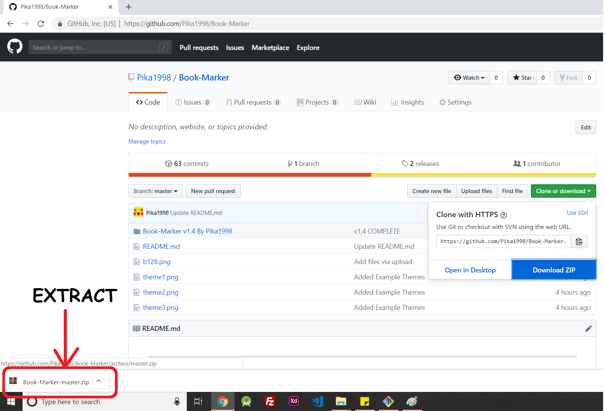
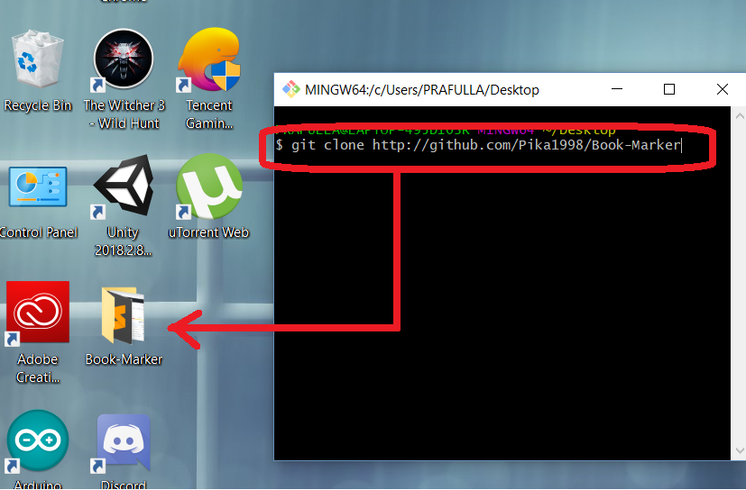
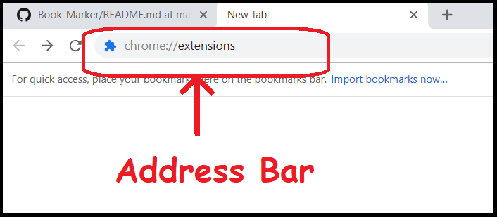
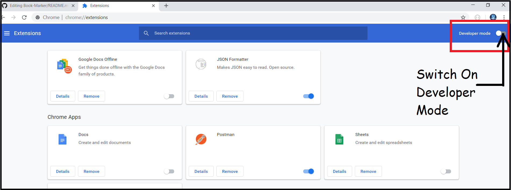
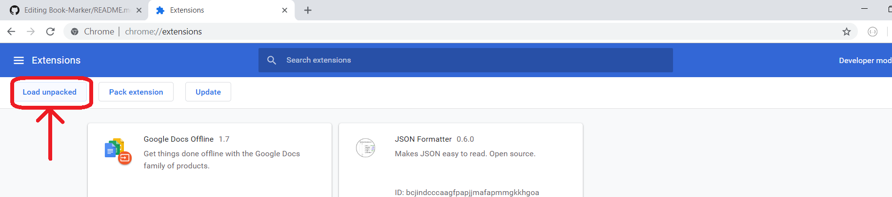
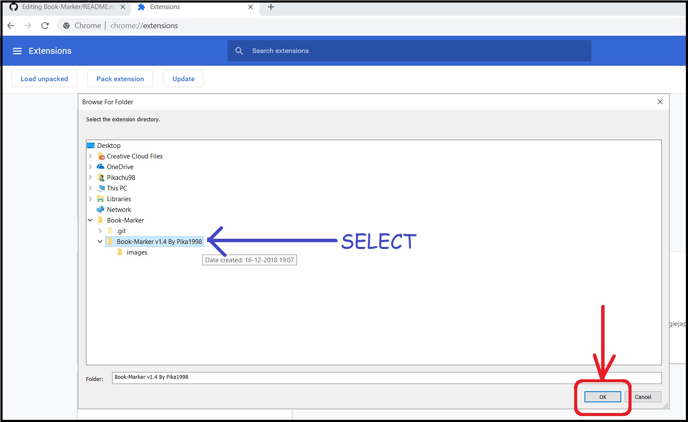
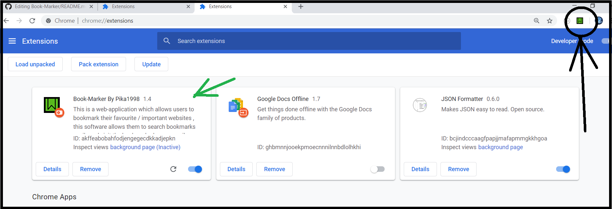
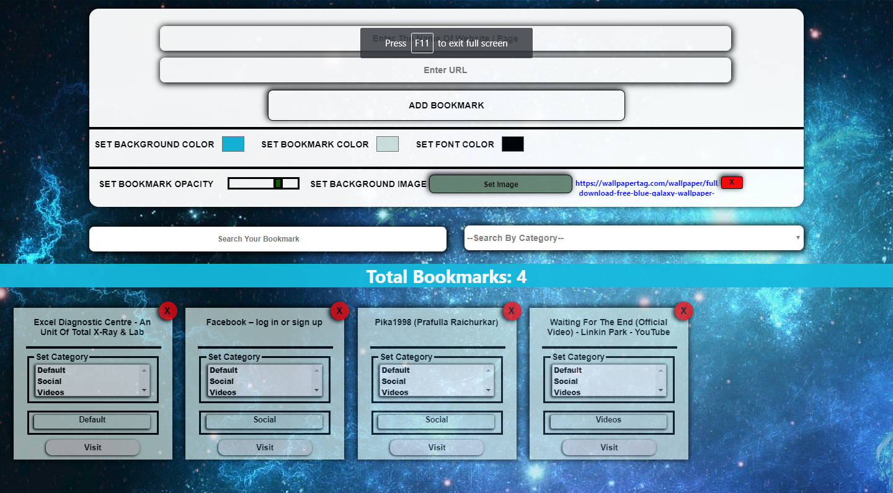
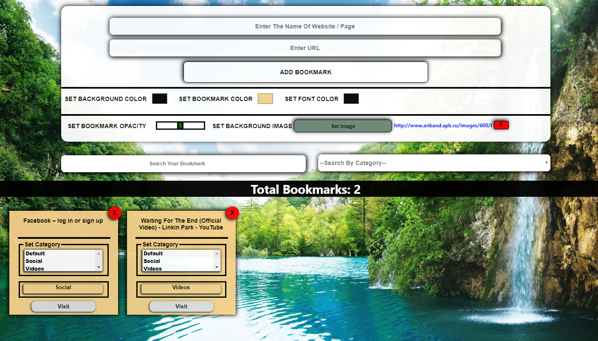
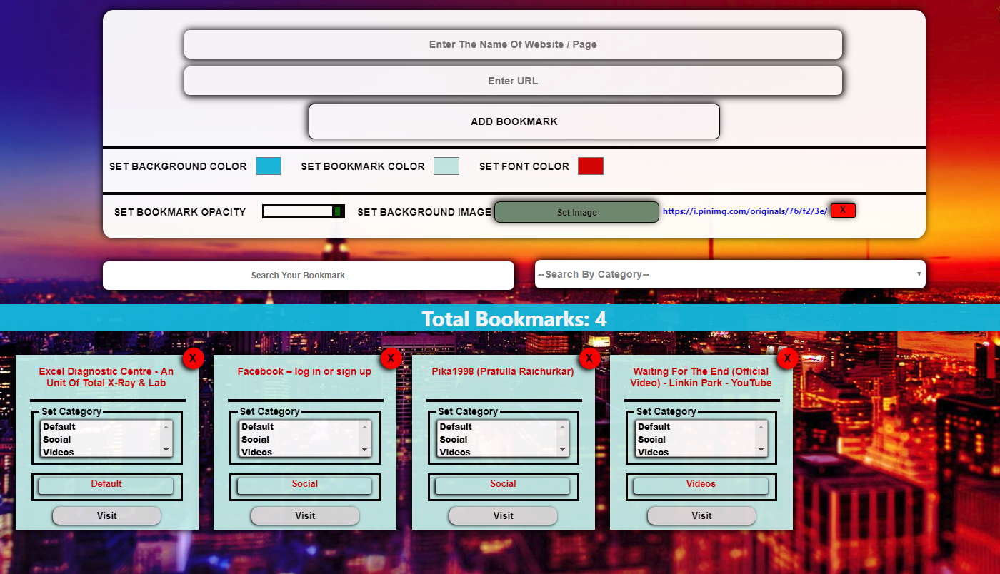

<h1 style="color:red" align="center"> Book-Marker By Pika1998 </h1>

Book-Marker is a google chrome extension , which allows users to bookmark their favourite / important websites.
 
This extension allows :
<ul type="square">
 <b><i>
 <li> Bookmark Creation & Management</li>
 <li> Category Management </li>
 <li> User Interface (UI) Control </li>
 <li> Category Search </li>
  </b></i>
</ul>

<h2>Installation</h2>
<b><i>
<ol>
 <li>Download / Clone this repository onto your desktop / other folders.  
  
 <b><i>
 
 
 Download the zip file & extract it using WinRAR / WinZip

 <a href="https://www.win-rar.com/predownload.html?&L=0"> Click Here To Get WinRAR</a>
  
 Or clone the repository using Git  

  <a href="https://git-scm.com/downloads"> Click Here To Download Git </a>
  </b></i>
  
 
 <b><i> </li>

  <li>Open google chrome browser & type "chrome://extensions" in the address bar 
   
   
 
This will open the Google Chrome Extension Manager

</li></b></i>
<b><i><li>
 Toggle / Turn ON the Developer Mode using the toggle switch.
  
 </li></b></i>
 <b><i><li>
Click on the "Load Unpacked" Button   Note: this button won't appear if you are not in developer mode 
 </li></b></i>
 <b><i><li> After Clicking on "Load Unpacked" you will be prompted with a browse window to search for a folder , locate to the Book-Marker folder which you get after extracting the zip file / cloning the repository .

Path :-  Book-Marker --> Book-Marker v1.4 By Pika1998 

</li></i></b>
<b><i><li>
 Once you've done all the above steps , you will find "Book-Marker By Pika1998" extension in the extension list , and also the icon pointed at the image below.

This indicates successful installation & you can start using the Book-Marker :).
</li></i></b>
  </ol>     
 
  

 </b></i>

<h2> Demo </h2>

 
 

